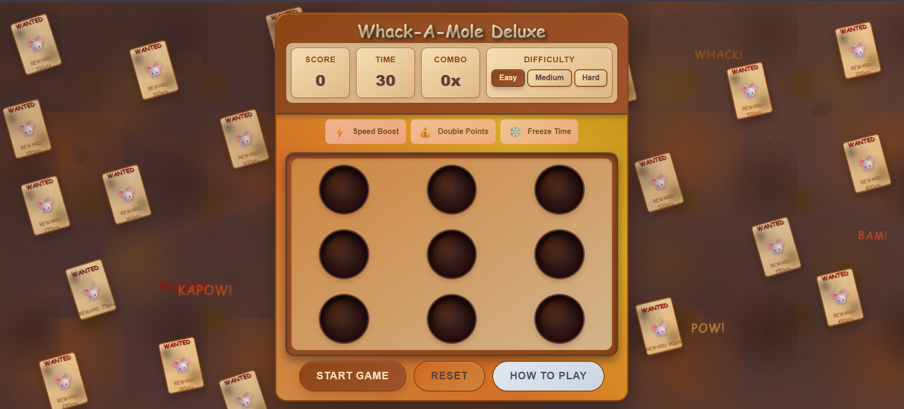

# 🎯 Whack-A-Mole Deluxe

> A modern, immersive whack-a-mole game featuring unique gameplay mechanics, stunning visuals, and responsive design. Built with vanilla HTML, CSS, and JavaScript.

<div align="center">
  
</div>

[](LICENSE)
[](https://developer.mozilla.org/en-US/docs/Web/JavaScript)
[](https://developer.mozilla.org/en-US/docs/Web/CSS)
[](https://developer.mozilla.org/en-US/docs/Web/HTML)

## 🌟 Features

### 🎮 **Enhanced Gameplay**
- **Multiple Mole Types**: Regular (🐭), Golden (✨), and Bomb (💣) moles with unique behaviors
- **Dynamic Power-Up System**: Speed Boost ⚡, Double Points 💰, and Freeze Time ❄️
- **Combo Multiplier System**: Build streaks for up to 3x score multipliers
- **Progressive Difficulty**: Three difficulty levels (Easy, Medium, Hard) with adaptive gameplay
- **Real-time Statistics**: Live tracking of score, time, combo, and level progression

### 🎨 **Visual Excellence**
- **Western Theme**: Immersive muddy/dirt aesthetic with wanted posters and western elements
- **Responsive Design**: Seamless experience across desktop, tablet, and mobile devices
- **Smooth Animations**: CSS-powered transitions and floating score indicators
- **Dynamic Background**: Animated particles, dirt clumps, and atmospheric effects
- **Modern UI**: Clean interface with gradient backgrounds and shadow effects

### 🔧 **Technical Features**
- **Pure Vanilla JavaScript**: No frameworks or dependencies required
- **Object-Oriented Architecture**: Clean, maintainable code structure
- **CSS Grid & Flexbox**: Modern layout techniques for perfect responsiveness
- **Web Audio API**: Dynamic sound generation for immersive audio experience
- **Local Storage**: High score persistence across sessions
- **Cross-Browser Compatible**: Works on all modern browsers

## 🚀 Quick Start

### Option 1: Play Online
[**🎮 Play Now**](https://your-username.github.io/whack-a-mole) - No installation required!

### Option 2: Run Locally
```bash
# Clone the repository
git clone https://github.com/your-username/whack-a-mole.git

# Navigate to project directory
cd whack-a-mole

# Open in browser
open index.html
# or simply double-click index.html
```

## 🎯 How to Play

1. **🎮 Start**: Click "Start Game" to begin your whacking adventure
2. **🐭 Whack Moles**: Click on moles as they pop up from holes
3. **✨ Golden Bonus**: Hit golden moles for 50 bonus points
4. **💣 Avoid Bombs**: Don't click bomb moles - they'll cost you points and break combos
5. **🔥 Build Combos**: Hit consecutive moles to multiply your score
6. **⚡ Use Power-ups**: Collect temporary abilities to boost your performance
7. **🏆 High Score**: Beat your personal best in 30 seconds!

## 📊 Game Elements

| Element | Points | Description |
|---------|--------|-------------|
| 🐭 Regular Mole | +10 | Standard target - hit for basic points |
| ✨ Golden Mole | +50 | Rare bonus mole with sparkle effects |
| 💣 Bomb Mole | -20 | Dangerous - avoid to prevent score loss |
| ⚡ Speed Boost | Power-up | Increases mole spawn rate |
| 💰 Double Points | Power-up | 2x points for all successful hits |
| ❄️ Freeze Time | Power-up | Pauses the countdown timer |

## 🏗️ Project Structure

```
whack-a-mole/
├── 📄 index.html          # Game HTML structure & layout
├── 🎨 styles.css          # Responsive CSS with animations
├── ⚙️ script.js           # Game logic & mechanics
├── 📖 README.md           # Project documentation
└── 📜 LICENSE             # MIT License file
```

## 🛠️ Technical Implementation

### **Core Technologies**
- **HTML5**: Semantic markup with accessibility features
- **CSS3**: Modern styling with Grid, Flexbox, and animations
- **JavaScript ES6+**: Object-oriented programming with classes
- **Web Audio API**: Dynamic sound generation

### **Key Features**
- **Responsive Design**: Mobile-first approach with breakpoints
- **Performance Optimized**: Efficient DOM manipulation and event handling
- **Cross-Browser Support**: Compatible with all modern browsers
- **No Dependencies**: Pure vanilla JavaScript implementation

### **Architecture Highlights**
```javascript
class WhackAMoleGame {
    constructor() {
        this.gameState = 'idle';
        this.score = 0;
        this.timeLeft = 30;
        this.combo = 0;
        this.level = 1;
        // ... game initialization
    }

    startGame() { /* Game logic */ }
    spawnMole() { /* Mole spawning */ }
    handleMoleClick() { /* Click handling */ }
    // ... additional methods
}
```

## 🎮 Game Mechanics Deep Dive

### **Scoring System**
- **Base Points**: Determined by mole type (Regular: 10, Golden: 50)
- **Combo Multiplier**: Increases by 0.1x per consecutive hit (max 3.0x)
- **Power-up Bonus**: Double Points power-up multiplies score by 2x
- **Penalty System**: Bomb moles deduct 20 points and reset combo

### **Difficulty Progression**
- **Easy Mode**: 1000ms base spawn interval, 15% golden, 5% bomb chance
- **Medium Mode**: 800ms base spawn interval, 12% golden, 8% bomb chance
- **Hard Mode**: 600ms base spawn interval, 10% golden, 12% bomb chance

### **Power-up Mechanics**
- **Activation**: 5% chance on successful mole hits
- **Duration**: 5 seconds with visual progress indicators
- **Cooldown**: 15-second period between power-up activations
- **Types**: Randomly selected from available power-ups

## 🔧 Customization Guide

Easily modify game settings in `script.js`:

```javascript
// Game Configuration
const GAME_CONFIG = {
    GAME_DURATION: 30,           // Game length in seconds
    MOLE_VISIBLE_TIME: 800,      // How long moles stay up (ms)
    BASE_SPAWN_INTERVAL: 1000,   // Base time between spawns (ms)
    MAX_COMBO_MULTIPLIER: 3.0,   // Maximum combo multiplier
    POWER_UP_DURATION: 5000,     // Power-up duration (ms)
    POWER_UP_COOLDOWN: 15000,    // Cooldown between power-ups (ms)

    // Probability Settings
    GOLDEN_MOLE_CHANCE: 0.15,    // 15% chance for golden moles
    BOMB_MOLE_CHANCE: 0.10,      // 10% chance for bomb moles
    POWER_UP_CHANCE: 0.05        // 5% chance for power-up activation
};
```

## 🌐 Browser Compatibility

| Browser | Version | Status |
|---------|---------|--------|
| Chrome | 60+ | ✅ Fully Supported |
| Firefox | 55+ | ✅ Fully Supported |
| Safari | 11+ | ✅ Fully Supported |
| Edge | 79+ | ✅ Fully Supported |
| Opera | 47+ | ✅ Fully Supported |

## 📱 Responsive Breakpoints

- **Desktop**: 1200px+ (Large game board, full features)
- **Tablet**: 768px - 1199px (Medium board, optimized layout)
- **Mobile**: 480px - 767px (Compact board, touch-friendly)
- **Small Mobile**: <480px (Minimal board, essential features)

## 🚀 Performance Features

- **Optimized Animations**: Hardware-accelerated CSS transforms
- **Efficient Event Handling**: Debounced click events and optimized listeners
- **Memory Management**: Proper cleanup of intervals and event listeners
- **Lazy Loading**: Background elements loaded progressively
- **60fps Animations**: Smooth visual effects using requestAnimationFrame

## 🤝 Contributing

We welcome contributions! Here's how you can help:

### **Getting Started**
1. Fork the repository
2. Create a feature branch (`git checkout -b feature/amazing-feature`)
3. Commit your changes (`git commit -m 'Add amazing feature'`)
4. Push to the branch (`git push origin feature/amazing-feature`)
5. Open a Pull Request

### **Contribution Ideas**
- 🎵 Add more sound effects and music
- 🏆 Implement leaderboard system
- 🎨 Create new themes and visual styles
- 🎮 Add new game modes (endless, time attack, etc.)
- 📱 Improve mobile experience
- 🌍 Add internationalization support

## 📄 License

This project is licensed under the MIT License - see the [LICENSE](LICENSE) file for details.

## 🙏 Acknowledgments

- Inspired by classic arcade whack-a-mole games
- Western theme assets and design inspiration
- Modern web development best practices
- Community feedback and suggestions

## 📞 Support

- 🐛 **Bug Reports**: [Open an issue](https://github.com/your-username/whack-a-mole/issues)
- 💡 **Feature Requests**: [Start a discussion](https://github.com/your-username/whack-a-mole/discussions)
- 📧 **Contact**: your-email@example.com

---

<div align="center">

**🎯 Ready to test your reflexes? [Play Whack-A-Mole Deluxe](https://your-username.github.io/whack-a-mole) now! 🏆**

Made with ❤️ by [Your Name](https://github.com/your-username)

⭐ **Star this repo if you enjoyed the game!** ⭐

</div>